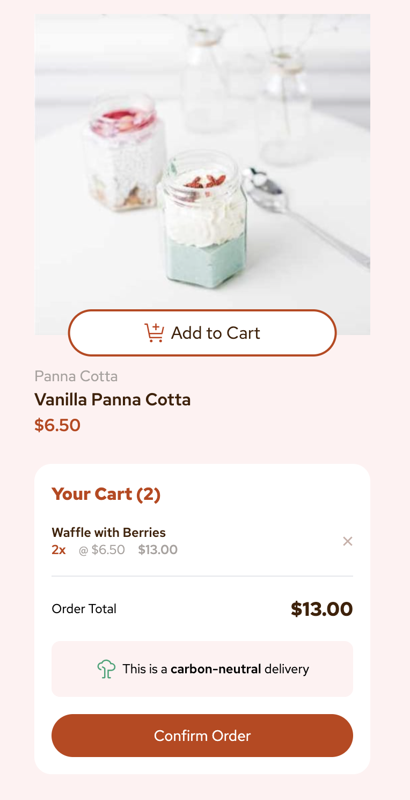

# Frontend Mentor - Product list with cart solution

This is a solution to the [Product list with cart challenge on Frontend Mentor](https://www.frontendmentor.io/challenges/product-list-with-cart-5MmqLVAp_d).

## Table of contents

- [Overview](#overview)
  - [The challenge](#the-challenge)
  - [Screenshot](#screenshot)
  - [Links](#links)
- [My process](#my-process)
  - [Built with](#built-with)
- [Author](#author)

## Overview

### The challenge

Users should be able to:

- Add items to the cart and remove them
- Increase/decrease the number of items in the cart
- See an order confirmation modal when they click "Confirm Order"
- Reset their selections when they click "Start New Order"
- View the optimal layout for the interface depending on their device's screen size
- See hover and focus states for all interactive elements on the page

### Screenshot

### Links

- Live Site URL: [Live Site](https://product-page-example.netlify.app/)

## My process

### Built with

- Semantic HTML5 markup
- CSS
- CSS Grid
- TailwindCSS
- HeadlessUI
- ReactJS
- TypeScript
- Vite
- React Testing Library
- Vitest

### Get Started

1. Clone the repository
2. Install dependencies with `npm i`
3. Start the dev environment with `npm run dev`
4. Run test with `npm test`

## Author

- Website - [ladeoshodi.com](https://ladeoshodi.com/)
- Frontend Mentor - [@ladeoshodi](https://www.frontendmentor.io/profile/ladeoshodi)
